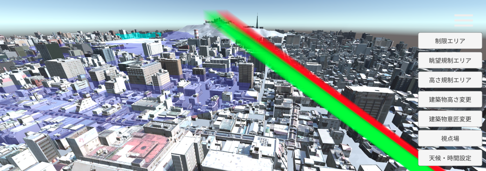
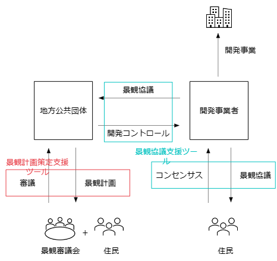

# 景観まちづくり支援ツール

## 概要
この資料では景観まちづくり支援ツールの作業手順を記載します。

景観まちづくり支援ツールは、従来2次元の地図を使って行われている景観計画を3次元的に可視化することで円滑かつ高解像度におこなえるように改善するものです。景観まちづくり支援ツールには景観計画策定支援と景観協議支援のためのツールが含まれます。

## 景観計画策定支援
地方公共団体が景観保全のために規制エリア・眺望保全区域を策定する、「景観計画策定」を行うための支援機能として以下の機能を提供しています。

- shapeファイル形式の景観計画を読み込む機能
- shapeファイル形式の景観計画を書き出す機能
- 景観計画(規制エリア・眺望規制)の作成・編集機能
- 視点場からの見え方を確認する機能

## 景観協議支援
新規建築物を開発する開発事業者が建築物の景観への影響を協議する、「景観協議」を行うための支援機能として以下の機能を提供しています。

- shapeファイル形式の景観計画を読み込む機能
- 視点場からの見え方を確認する機能
- 天候・時間帯を変更する機能
