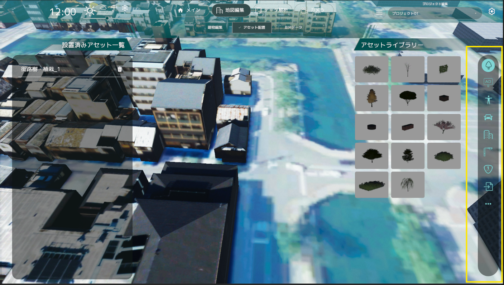
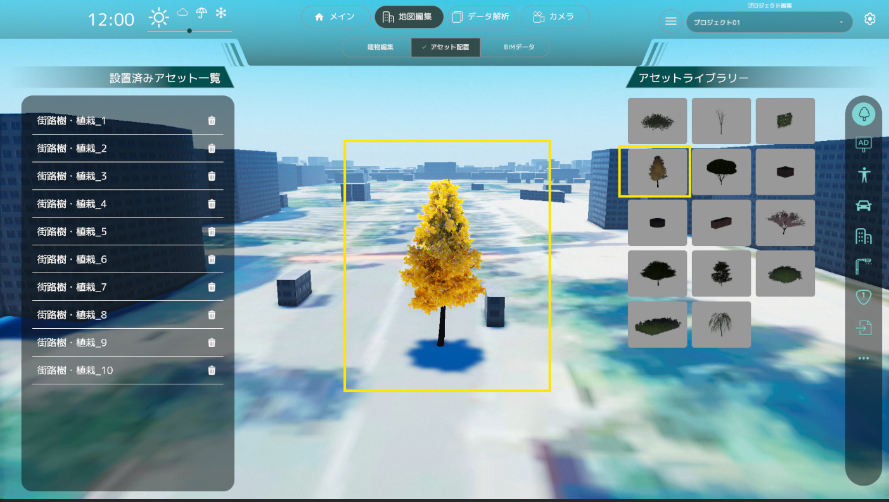
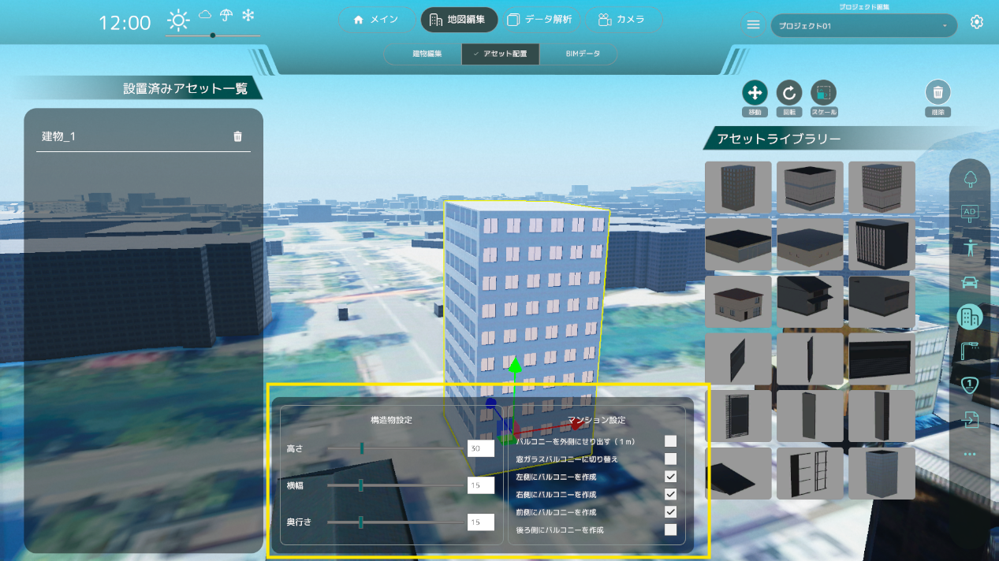
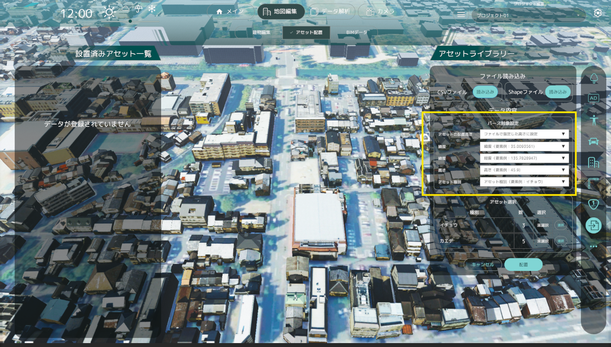
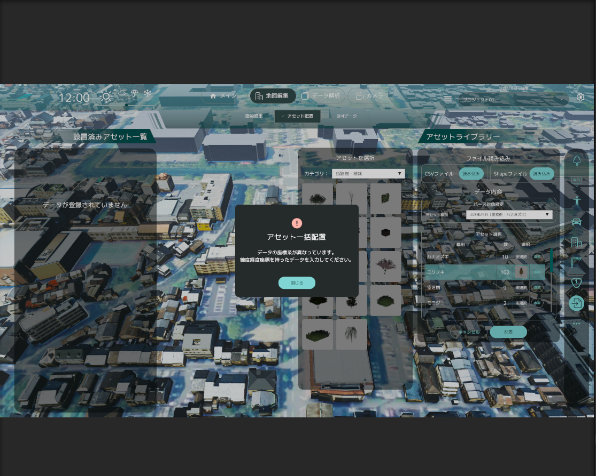

# アセット配置機能の操作方法
## メイン画面

- アセットは種類ごとに右アイコンメニュー内に分類されて格納されています。
- アセットの種類は「樹木」、「広告」、「人」、「乗り物」、「建物」、「街灯」、「交通系オブジェクト」、「その他」の8種類です。
- 各アイコンボタンを押すと左のリストが切り替わります。
- デフォルトでは「樹木」が選択されています。

## アセットの配置

- アセットの写真をクリックすることで配置するアセットを選択します。
- アセット選択後に3D空間上で再度クリックすることでアセットを配置します。
- アセット配置をやめたい場合は右クリックしてください。

## アセットの編集

- アセットをクリックすることでアセットが選択状態になり、編集が行えます。
- 選択中に画面上に編集ボタンアイコンが表示され、選択することで「位置」、「向き」、「大きさ」を編集、またはアセットを削除することが出来ます。
- 右クリックで編集状態を解除します。

## アセットリスト

- アセットリストには配置されたアセットの一覧が表示されます。
- アセットリストのアイテムをクリックすることで、配置したアセットに自動でフォーカスされます。
- 削除アイコンを押すことで削除することも可能です。

## 広告物の変更

- 広告アセットを選択すると、右上に広告の変更ボタンが表示されます。
- 画像読み込みボタン、動画読み込みボタンを押すと、ファイルブラウザが開かれるので画像もしくは動画を選択できます。
- 選択が完了すると、広告の画像が変更されます。動画の場合は再生が始まります。

## 建造物の変更

- 建造物アセットを選択すると、画面中央下に建造物の設定パネルが表示されます。
- どの建物にも共通しているパラメータ「建物の高さ」「建物の横幅」「建物の奥行き」を変更できます。
- 建造物タイプに応じた個別のパラメータを設定することができます。
  - マンション
    - 窓ガラスバルコニーに切り替え：バルコニーの見た目を壁から窓ガラスに切り替えることができます。
    - 左側にバルコニーを作成：建物の左側面にバルコニーを追加します。
  - コンビニエンスストア
    - 側面を壁に設定：側面を窓ガラスから壁に切り替えることができます。
    - 屋根の厚さ：屋根の厚さを指定できます。
  - 一軒家
    - 階数：階数を1から3までの間で指定できます。
    - エントランスに庇を追加：一軒家の入り口に庇を追加できます。
    - 屋根タイプ：屋根の形状を以下から選択できます。
      - Flat：平屋根
      - Hipped：寄棟屋根
    - 屋根の厚さ：屋根の厚さを指定できます。
  - オフィスビル
    - 1階を窓に変更：建物の1階部分を壁から窓に変更できます。
    - 壁パネルの高さ：上下の窓ガラスに挟まれた壁パネルの高さを指定できます。

## アセットの一括配置
- 一括配置のメニューを選択し、CSVファイルやシェープファイルを読み込むことで、一括でアセットを配置できます。

### シェープファイルの読み込み
- 緯度、経度情報を持つシェープファイルを読み込むことができます。
- シェープファイルは座標系が投影座標系（平面直角座標系）であることを確認してください。 座標系の変更は、QGISなどのGISツールを使用して変更を行ってください。
- また、シェープファイルを読み込むためには、シェープファイルと同じ階層に属性情報を持つDBFファイル(.dbf)が存在している必要があります。

### シェープファイルのアセット種別の選択

シェープファイルに紐づけされている属性情報からアセット種別に指定する項目を選択します。

### CSVファイルの読み込み
- サンプルとなるCSVファイルは以下からダウンロードしてください。

[CSVファイルのサンプル](../resources/AssetPlacement/PlateauSandboxCSVTemplate.csv)

- CSVファイルには「緯度」「経度」「高さ」「アセット種別」の情報が必要です。エクセル等の表計算ソフトを使用して上記CSVファイルを作成してください。

- 「緯度」「経度」「高さ」に入力する値については、以下のURLを参考に入力してください。

[参考URL]
[TOPIC 3｜3D都市モデルデータの基本[4/4]｜CityGMLの座標・高さとデータ変換](https://www.mlit.go.jp/plateau/learning/tpc03-4/)

- CSVファイルに入力された高さ情報はそのままUnity上でのY座標として配置されます。

### CSVファイルのアセットの配置高さの設定

「アセットの配置高さ」の設定で 「ファイルで指定した高さに配置」 を選択していると、CSVファイルに記載されている高さ情報を使用してアセットを配置します。

「地面に配置」を選択することで、高さ情報を無視して地面に配置することができます。ただし「地面に配置」の場合、指定した緯度、経度にコライダーが存在しない場合はアセットは配置されません。

### CSVファイルの属性列の選択

属性列の選択ができます。「緯度」「経度」「高さ」「アセット種別」に紐づけたい属性列を選択してください。

### 配置するアセットの選択
- アセットの種別ごとに配置するアセットを選択できます。

### アセットの一括配置
- 「配置」ボタンを押すことでアセットが一括配置されます。
- 配置されたアセットはアセットリストに追加されます。
- アセット配置の結果はダイアログにて表示されます。
  - 「全てのアセットの配置に成功」
  - 「一部のアセットの配置に失敗」
  - 「全てのアセットの配置に失敗」

- 緯度、経度情報が正しくない場合、以下のダイアログが表示されます。シェープファイルの座標系を確認してください。
  - 「データの座標系が異なっています。緯度経度座標を持ったデータを入力してください。」

