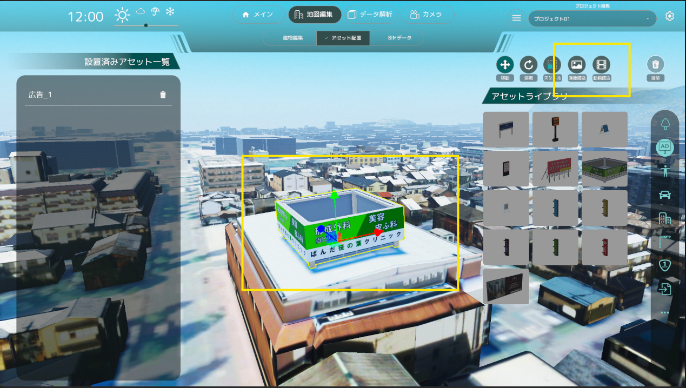

# アセット配置機能の操作方法
## メイン画面

- アセットは種類ごとに右アイコンメニュー内に分類されて格納されています。
- アセットの種類は「樹木」、「広告」、「人」、「乗り物」、「インフォメーション」、「街灯」、「交通系オブジェクト」、「公共オブジェクト」、「その他」の9種類です。
- 各アイコンボタンを押すと左のリストが切り替わります。
- デフォルトでは「樹木」が選択されています。
## アセットの配置

- アセットの写真をクリックすることで配置するアセットを選択します。
- アセット選択後に3D空間上で再度クリックすることでアセットを配置します。
- アセット配置をやめたい場合は右クリックしてください。
## アセットの編集

- アセットをクリックすることでアセットが選択状態になり、編集が行えます。
- 選択中に画面上に編集ボタンアイコンが表示され、選択することで「位置」、「向き」、「大きさ」を編集、またはアセットを削除することが出来ます。
- 右クリックで編集状態を解除します。
## 広告の変更

- 広告アセットを選択すると、右上に広告の変更ボタンが表示されます。
- 広告の変更ボタンを押すと、ファイルブラウザが開かれるので画像もしくは動画を選択できます。
- 選択が完了すると、広告の画像が変更されます。動画の場合は再生が始まります。

