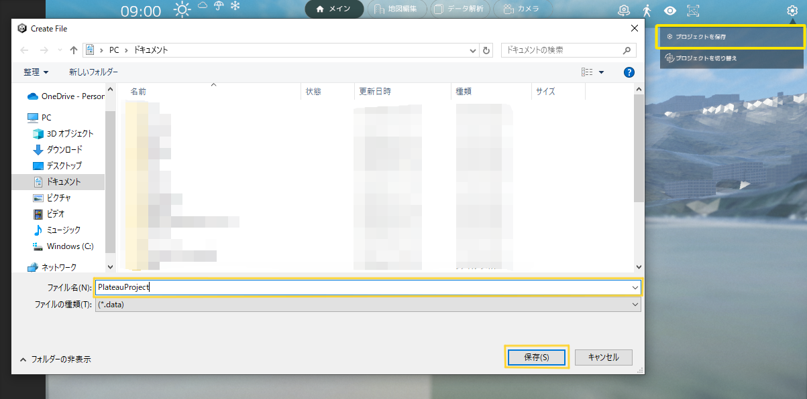
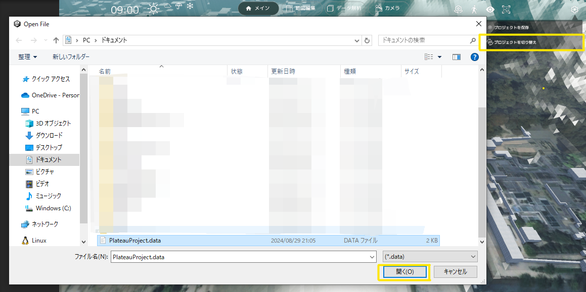

### 視点操作

- 通常時、マウスとキーボードを使用してカメラを操作することができます。

- マップを左クリックでドラッグしながら動かすことで、視点を水平に移動させることができます。

- WASD キーでも、視点を水平に移動させることができます。

- マップを右クリックでドラッグすることで、右クリックした場所を中心として視点を回転させることができます。

- Shift キーで視点を下げ、Space キーで視点を上げることができます。

- UI の上にマウスが乗っている時は、視点操作ができなくなります。マップ上にマウスを移動して操作してください。

### 天候/時間帯変更機能

- 各天候のアイコンをクリックすることで、天候を変更できます。

- 時間帯変更スライダーを調整することで、時間帯を変更できます。

### 自動回転機能

### 歩行者視点切り替え

- 歩行者視点ボタンをクリックすると、歩行者視点の位置を選択する状態になります。この状態でマップをクリックすると、クリックした位置で歩行者視点に切り替わります。

- 歩行者視点モードでは、WASD キーで移動することができます。

- また、E キーで視点を上昇、Q キーで視点を下降させることができます。

- マウスの右ボタンでドラッグすることで、視点を動かすことができます。

- 歩行者視点時、左下に操作コントローラ UI が表示されます。操作コントローラでも歩行者視点カメラを操作することができ、移動速度を変更することができます。

### UI 非表示機能

### 画面キャプチャー機能

### プロジェクト管理機能

- 画面右上の歯車アイコンを選択します。
#### プロジェクトの保存

- 「プロジェクトを保存」を選択します。
- ファイルブラウザが開かれるので、ファイル名を入力する。(拡張子は不要)
- 「保存」を押します。
#### プロジェクトの読み込み

- 「プロジェクトを切り替え」を選択します。
- ファイルブラウザからロードしたいファイルを選択します。
- 「開く」を押します。
