### 視点操作

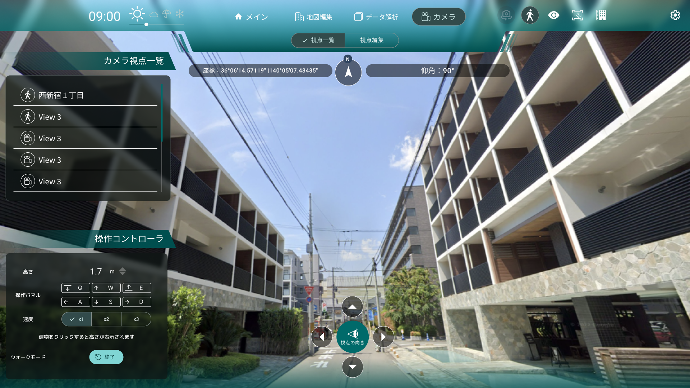

- 通常時、マウスとキーボードを使用してカメラを操作することができます。

- マップを左クリックでドラッグしながら動かすことで、視点を水平に移動させることができます。

- WASD キーでも、視点を水平に移動させることができます。

- マップを右クリックでドラッグすることで、右クリックした場所を中心として視点を回転させることができます。

- Shift キーで視点を下げ、Space キーで視点を上げることができます。

- UI の上にマウスが乗っている時は、視点操作ができなくなります。マップ上にマウスを移動して操作してください。

- 画面上部に緯度・経度・傾角度が表示されます。

- 画面中央下部の矢印ボタンで視点の回転が行えます。

### 天候/時間帯変更機能

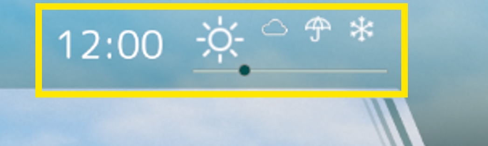

- 各天候のアイコンをクリックすることで、天候を変更できます。

- 時間帯変更スライダーを調整することで、時間帯を変更できます。

### 自動回転機能

- カメラ自動回転ボタンをクリックすると、俯瞰視点時にカメラを現在の注視点を中心に周囲を回転する様に動きます。

### 歩行者視点切り替え

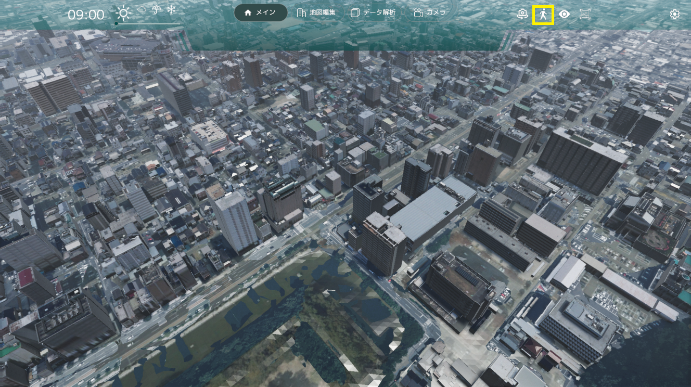

- 歩行者視点ボタンをクリックすると、歩行者視点の位置を選択する状態になります。この状態でマップをクリックすると、クリックした位置で歩行者視点に切り替わります。

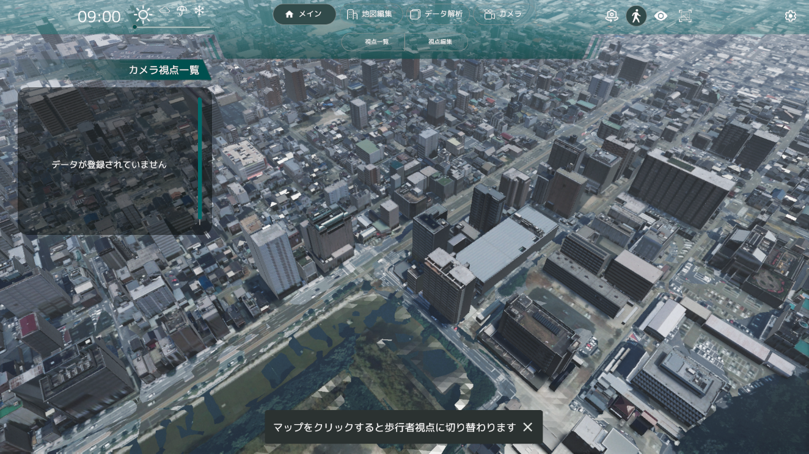

- 歩行者視点モードでは、WASD キーで移動することができます。

- また、E キーで視点を上昇、Q キーで視点を下降させることができます。

- マウスの右ボタンでドラッグすることで、視点を動かすことができます。

- 歩行者視点時、左下に操作コントローラ UI が表示されます。操作コントローラでも歩行者視点カメラを操作することができ、移動速度を変更することができます。

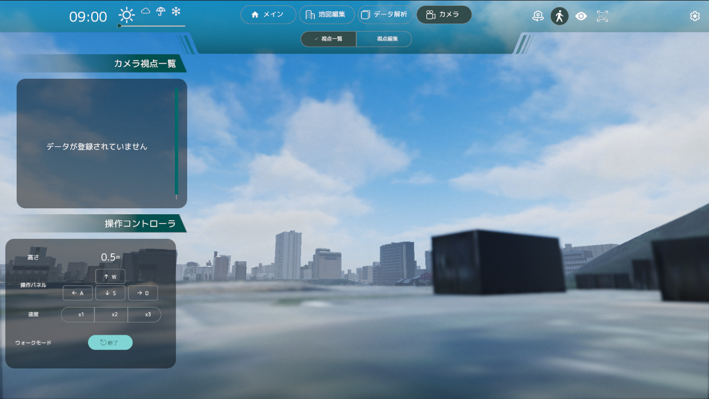

### UI 非表示機能

- UI 非表示切り替えボタンをクリックすると、画面上部のグローバルナビ以下の領域の UI の表示/非表示を切り替える事ができます。

- 非表示領域はこちらの黄枠の範囲に表示される領域です。

- UI 非表示切り替えボタンをクリックすると非表示になります。

### 画面キャプチャー機能

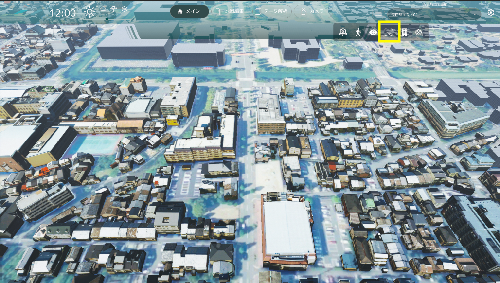

- 画面右上のスクリーンキャプチャアイコンを選択します

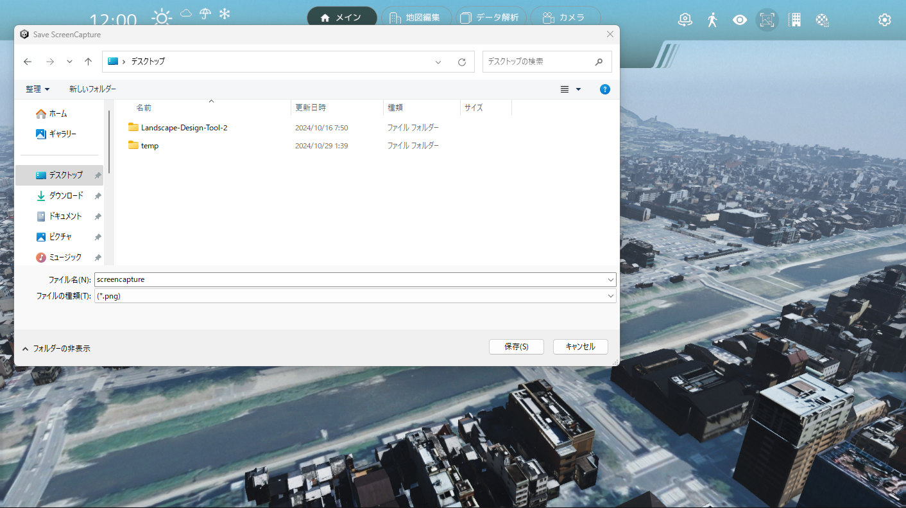

- ファイルブラウザが開かれるので、スクリーンキャプチャを保存するフォルダとファイル名を選択します
- 「保存」を押します

### プロジェクト管理機能

#### プロジェクト新規作成

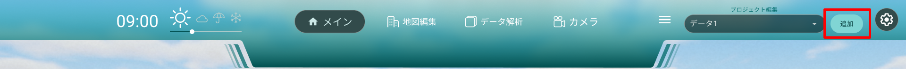

- 追加ボタンを押下すると新しいプロジェクトを作成することが出来ます。

#### プロジェクト全体を保存する

- 設定ボタンを押下し、リストから「プロジェクトを保存」を選択しすると PC 上に保存が可能です。

#### 別プロジェクトを読み込む

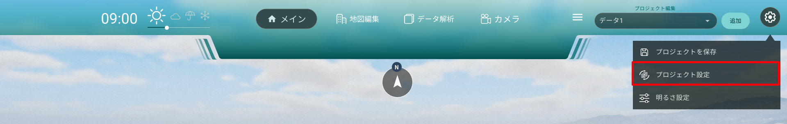

- 設定ボタンを押下し、リストから「プロジェクト読込」を選択しプロジェクトを選択すると、現在のプロジェクトに追加されます。

#### 個別のプロジェクトをリストから選択・編集する

- プロジェクトリストをクリックすると現在のシーンに作成されているプロジェクト一覧リストが表示されます。

- プロジェクト新規作成：プロジェクトの新規作成が行えます。
- 統合して保存：リストにあるプロジェクトを統合して１つのプロジェクトにします。
- 読み込み：外部のプロジェクトデータを読み込みます。

#### プロジェクトリスト

各リストには各種編集機能が個別で行えます。

- 書き出し：選択したプロジェクトの個別書き出しが行えます。
- 名前編集：名前の編集が行えます。
- 削除：選択したプロジェクトの削除が行えます。
- 上へ移動：リストのプライオリティを上げます。
- 下へ移動：リストのプライオリティを下げます。

### 建物高さ表示

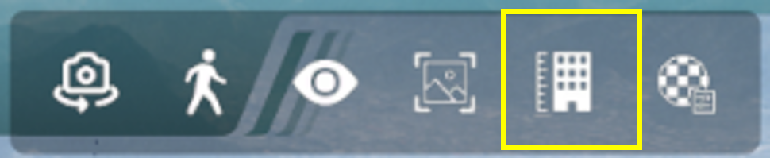

- 建物高さ表示ボタンをクリックすると、建物の上に高さが表示されます。
- 高さ表示設定スライダーを調整することで、表示したい建物の高さの下限値を設定できます。

- 歩行者視点モードでは、建物をクリックすることで高さが表示されます。

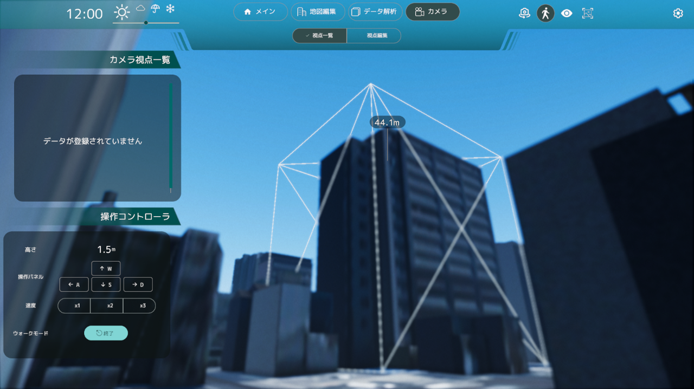
