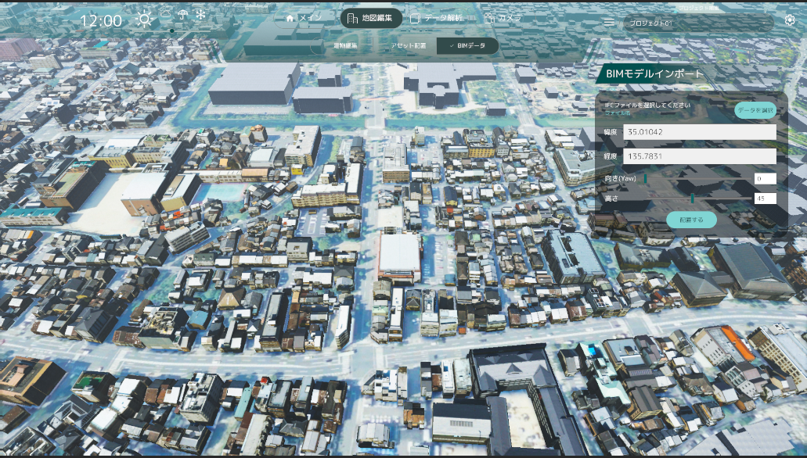
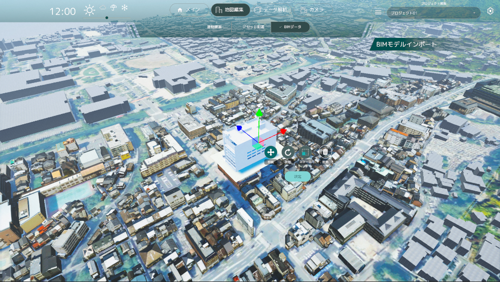

# BIMデータ

地図上にBIM(.ifc)データを取り込む事が可能です。

## メイン画面

- データを選択をクリックし、取り込むBIMデータ(IFCファイル)を選択します
- 配置位置(緯度経度)、角度、高さを設定します
- 配置する。ボタンを押してBIMデータの取り込みを開始します
- BIMデータの取り込みが完了すると、配置画面になります

## 配置画面

- 配置位置、角度、高さの微調整を行う事が可能です
- 配置をキャンセルする場合は削除ボタンを押す事でメイン画面に戻り、再度配置前の状態に戻る事ができます
- 配置場所の調整が終りましたら、決定ボタンを押して下さい。場所が確定されます
