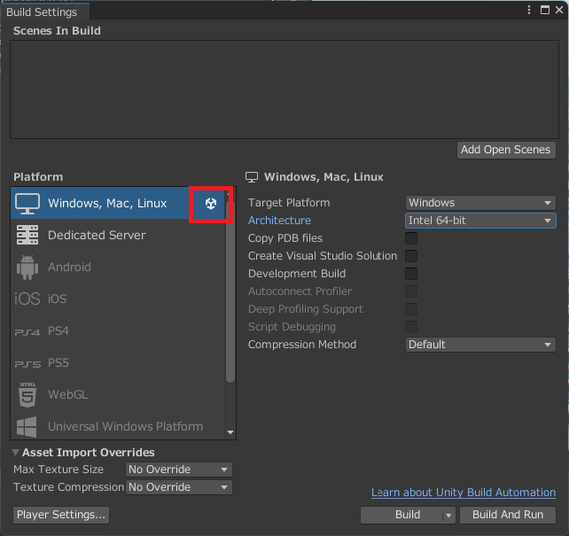
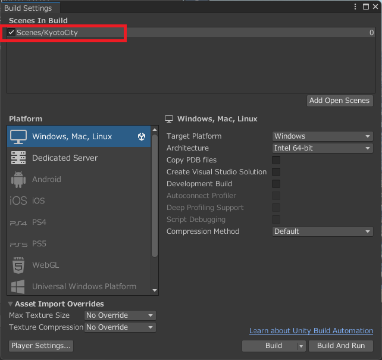
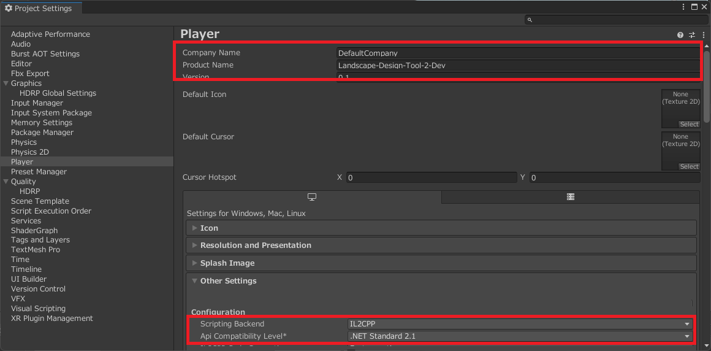
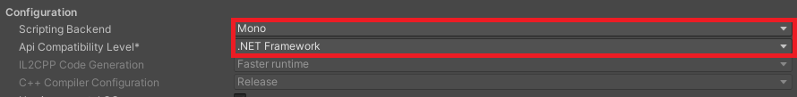
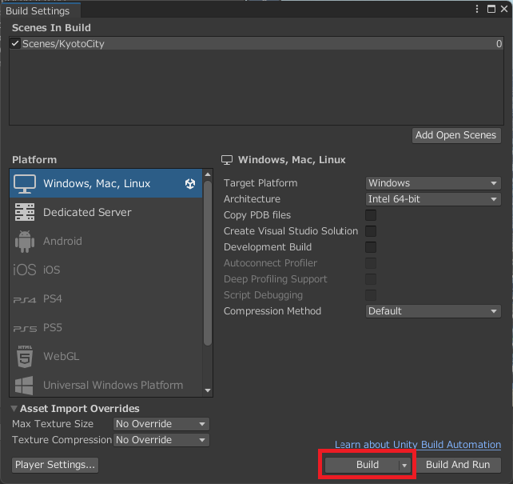
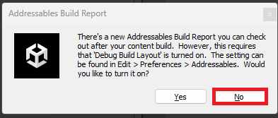

# ビルド

本ツールを使用するため Windows 向けにアプリケーションをビルドする手順を解説します。

なお、[基本操作](./BasicOperation.md)以降の手順はランタイム（実行時）の解説になります。

## 1. 準備

`File` → `Build Settings...` を開き、`Platform`が**Windows, Mac, Linux**であることを確認

   - 設定されていない場合は、以下の手順を実行
        - `Windows, Mac, Linux` を選択
        - `Target Platform` を **Windows** に設定
        - `Architecture` を **Intel 64bit** に設定（推奨）
        - `Switch Platform` ボタンをクリック

## 2. ビルド設定

1. `Build Settings` 画面でシーン（[セットアップ](./Setup.md)を行ったもの）を **Scenes In Build** に追加

    

1. `Player Settings...` をクリックし、以下の設定を確認

    
    
    

   - `Company Name`、`Product Name` を適切に設定
   - `Other Settings` → `Configuration` → `Scripting Backend` を `Mono` に設定
   - `Other Settings` → `Configuration` → `API Compatibility Level` を `.NET Standard` に設定

## 3. ビルド

1. `Build` ボタンをクリックし、出力フォルダを指定

    

   - もし次のようなウィンドウが表示されたら`No`を選択

    

1. ビルドが完了すると、指定フォルダ内に `.exe` ファイルが生成され、エクスプローラーで出力フォルダが開く

## 4. 実行

出力フォルダの`.exe` ファイルをダブルクリックして実行
