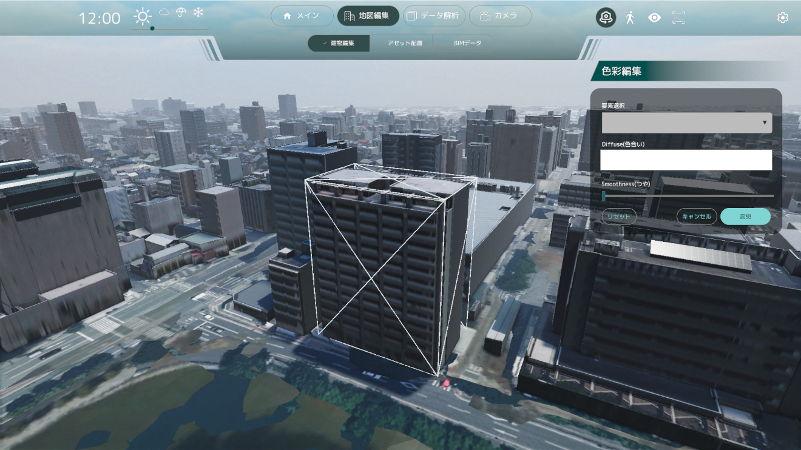
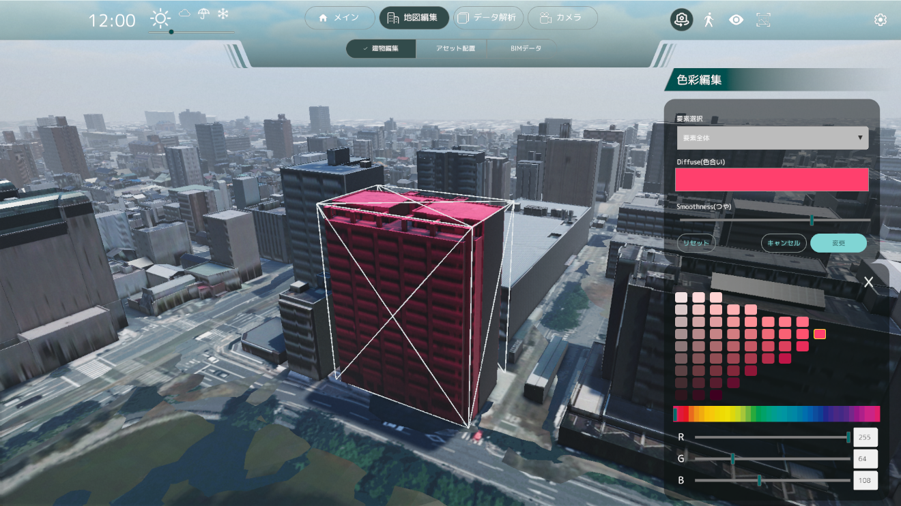
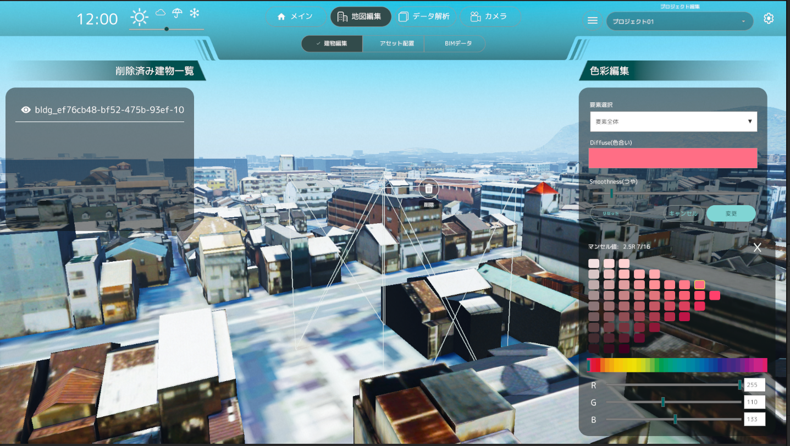
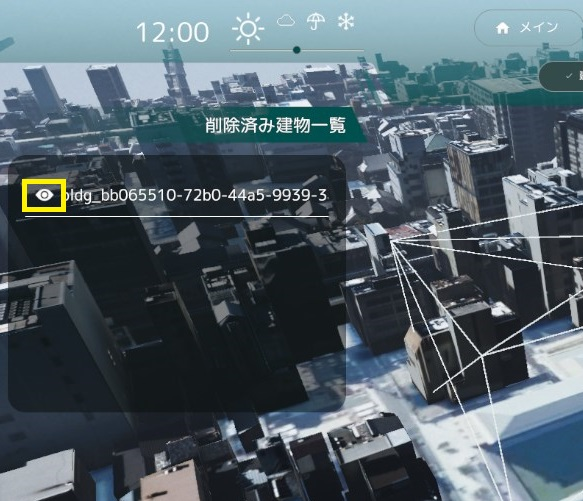

# 建物編集機能

- 建物編集機能では、建物の外観を編集できます。

- 編集したい建物をクリックすることで各機能を利用できます。

## 色彩編集

建物の色を編集できます。

- プルダウンから編集する要素(要素全体，壁，屋根/屋上)を選択した後、「Diffuse(色合い)パネル」をクリックすると色彩調整ウィンドウが表示されます。

- 色彩調整ウィンドウでは、マンセル表およびRGB値スライダーから色を調整できます。

- Smoothnessスライダーからつやを調整できます。

- 調整後「変更」ボタンをクリックすることで、建物の色を変更することができます。

- 建物の色をリセットしたい場合は、「リセット」ボタンをクリックすることで、変更内容をリセットすることができます。

- 選択した色をリセットしたい場合は、「キャンセル」ボタンをクリックすることで、変更内容をリセットすることができます。

## 既存建物削除

- 編集している建物に重なって表示されている「削除」ボタンを押します

- 削除ボタンを押下した建物は削除され、左の「削除済み建物一覧」リストに追加されます

- リストに追加された建物の左側にあるアイコンをクリックすると、削除済み建物一覧リストから削除され、地図上に復元されます
