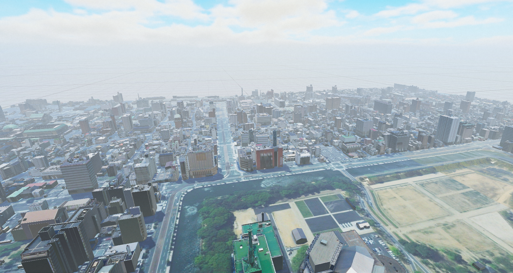
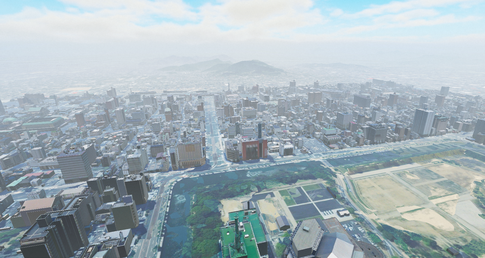

# 遠景表示設定

近景と遠景を適切に設定することで、パフォーマンスを最適化しつつ、都市の広がりを自然に表現できます。

遠景として設定されたエリアでは、都市モデルの詳細な地形データを使用せず、より軽量な手法で描画することで、負荷を軽減しつつ視認性を向上させます。これにより、都市全体の規模を把握しやすくなり、より自然な景観を実現できます。

## 設定方法

遠景として表示するエリアを確認し、[セットアップ](../manual/Setup.md)時に都市モデルのインポート対象から除外します。

遠景エリアの設定には、[PLATEAU-SDK-Maps-Toolkit-for-Unity](https://github.com/Project-PLATEAU/PLATEAU-SDK-Maps-Toolkit-for-Unity) を使用します。

詳細な設定方法については、[利用マニュアル](https://github.com/Project-PLATEAU/PLATEAU-SDK-Maps-Toolkit-for-Unity?tab=readme-ov-file#plateau-sdk-maps-toolkit-for-unity-%E5%88%A9%E7%94%A8%E3%83%9E%E3%83%8B%E3%83%A5%E3%82%A2%E3%83%AB) を参照してください。