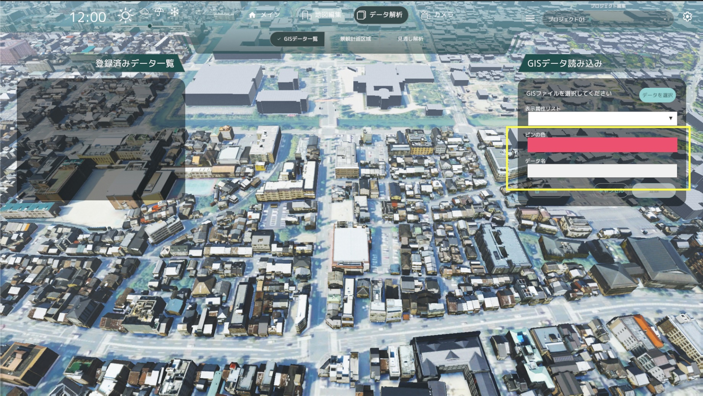
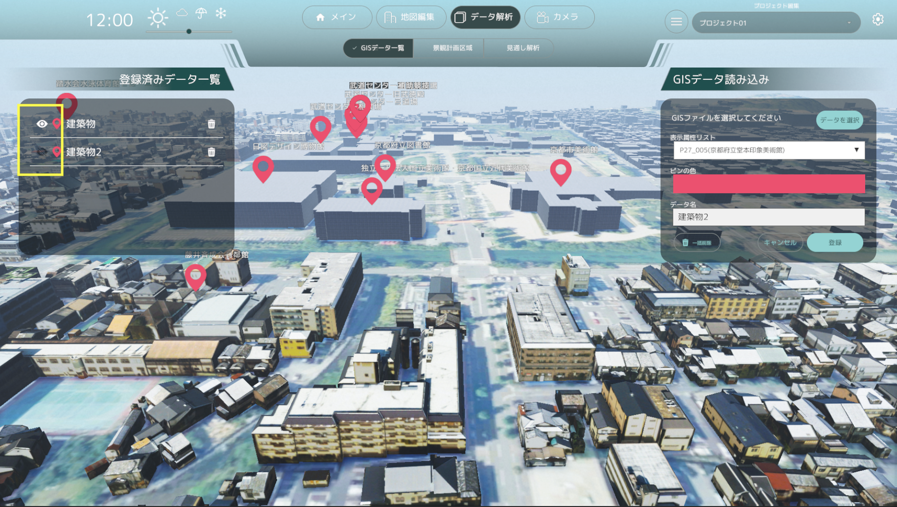

# GISデータ読み込み画面の操作方法

- GISデータ読み込み画面では、ShapeファイルもしくはGeoJSONファイルを読み込むことができます。
- 読み込んだGISデータを元に、建物上部に関連した建物情報とピンを表示できます。

## ShapeファイルとGeoJSONファイルの取得
- 表示させたい施設のカテゴリーのShapeファイルやGeoJSONファイルを、以下のURLの「施設」の一覧からダウンロードしてください。
- 施設のカテゴリーに応じてShapeファイルもしくはGeoJSONファイルが用意されています。

[国土数値情報ダウンロードサイト](https://nlftp.mlit.go.jp/ksj/index.html#chiiki)

## GISデータの読み込み
- 「データを選択」ボタンよりShapeファイルもしくはGeoJSONファイルを読み込みできます。

- ShapeファイルとGeoJSONファイルのどちらのファイルを選択するかは、表示されたエクスプローラーよりファイル形式を切り替えて選択してください。

## 表示属性リストの選択

- 読み込んだGISデータの属性リストから、表示する属性を選択できます。

## カラー選択とデータ名入力

- カラー選択ボタンをクリックすると、色選択ウィンドウが表示されます。
- 色選択ウィンドウで色を選択すると、選択した色が適用されます。
- データ名に登録したいデータ名を入力してください。

## データの登録

- 「データを登録」ボタンをクリックすると、データが登録され、該当の施設の上部にピンが表示されます。
- 登録したデータは、「登録済みデータ一覧」に表示されます。

## データの表示、非表示、削除

- 登録済データ一覧の表示アイコンをクリックすると、ピンの表示を切り替えできます。

- 登録済データ一覧の削除アイコンから、削除したいデータを選択して削除できます。
- 「一括削除」ボタンをクリックすると、登録済みのデータを一括削除できます。

