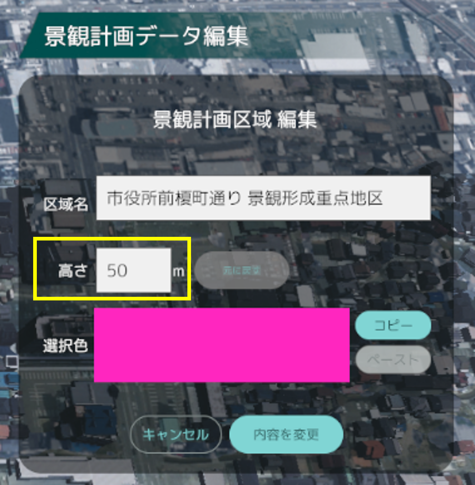
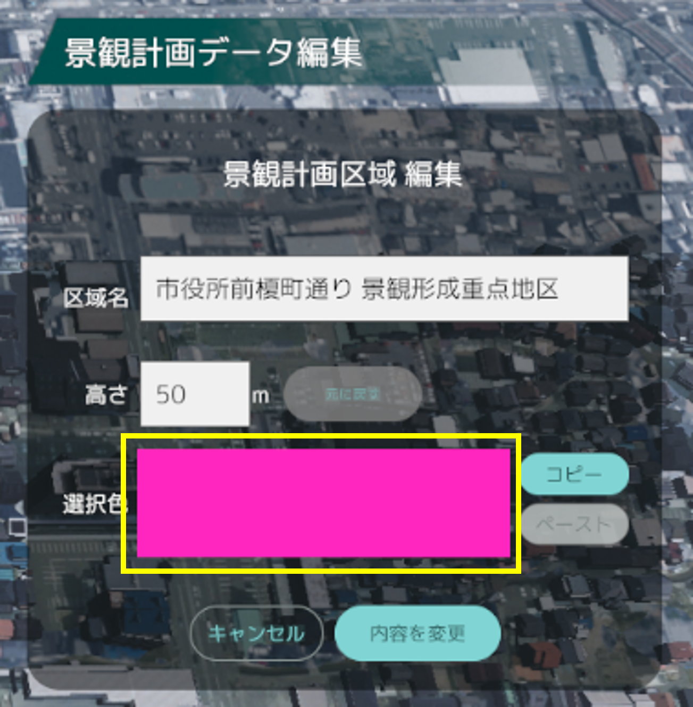

# 景観計画区域画面の操作方法
景観計画区域画面では、Shapefile形式の景観計画区域の読み込み・可視化・編集を行います。

## 景観計画区域のデータ形式
### Shapeファイルデータ形式
この機能では、以下のデータ形式のShapeファイルに対応しています。
- ストレージ：ESRI Shapefile
- 文字コード：Shift_JIS
- ジオメトリ：Polygon (MultiPolygon)
- 座標参照系(CSR)：EPSG:4326-WGS84（緯度経度形式）

### 属性テーブル形式
属性テーブルには以下の項目を設定できます。
 　※項目が存在しない場合は、初期値が適用されます。
 　※以下の項目以外の属性が含まれる場合でも動作に支障はありません。

| 項目名   | 型                | 入力情報　　　　  |入力データ形式                                   | 初期値       |
|----------|-------------------|-----------------|-----------------------------------------------|--------------|
| ID       | テキスト(string)   | ID番号          |整数値                                          | 0            |
| AREANAME | テキスト(string)   | 区域名          |半角・全角文字                                   | 空欄         |
| HEIGHT   | テキスト(string)   | 区域の高さ制限値 |正の実数値                                     | 0            |
| COLOR    | テキスト(string)   | 区域の表示色     |RGB形式 「,」区切り 0から1の範囲の小数値       | 白色 (1,1,1) |

入力例

## 画面構成
- 「エリア情報」パネルでは、選択中の景観計画区域の区域名と高さ制限値が表示されます。
- 「景観計画区域リスト」パネルでは、読み込み済みの景観計画区域の一覧が表示されます。ゴミ箱ボタンをクリックすると、該当区域を削除します。
- 「景観計画データ編集」パネルでは、景観計画区域の読み込みが行えます。
- 景観計画区域の壁には、上辺と高さ10mごとにラインが描画されます。

  
## 景観計画データの読み込み
「景観計画データ編集」パネルのデータ読み込みボタンをクリックすると、エクスプローラーが表示されます。

読み込む景観計画のShapeファイルとdbfファイルが含まれるフォルダーを選択し、「フォルダーの選択」をクリックします。
 
「景観計画区域リスト」パネルにエリア情報が追加されると読み込み完了です。
 　※読み込みには数秒を要する場合があります。
 

## 区域情報の編集
「景観計画区域リスト」パネルから編集したい区域名を選択します。
次に「景観計画データ編集」パネルの「データを編集」ボタンをクリックし、編集を開始します。

編集では、区域名、高さ制限値、区域カラーを変更できます。

編集完了後は「内容を変更」ボタンをクリックし、変更内容を保存します。
 　※「キャンセル」または他の区域が選択された場合、変更内容は破棄されます。

### 区域名編集
- 区域名は半角・全角文字に対応しています。
 　※全角文字入力後はEnterキーを押して変換を確定させてください。

### 高さ制限値の編集
- 高さ制限値の入力は半角数字のみ対応します。
- 右側の矢印ボタンをクリックすることで、1メートルずつ値が増減します。

### 区域カラー編集
- 選択色のパネルをクリックすると「色彩変更」パネル表示されます。
- カラー選択は、マンセル表またはRGB値での入力に対応します。
- 「リセット」ボタンをクリックすると、変更前の色が設定されます。
- パネル右上の☓ボタン、または再度選択色のパネルをクリックするとパネルが閉じます。

