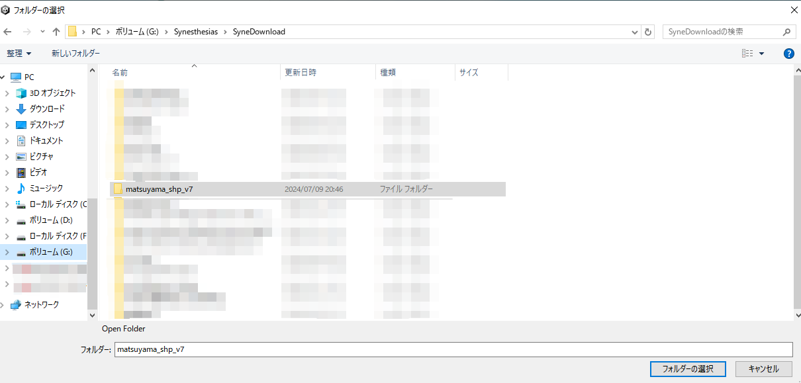
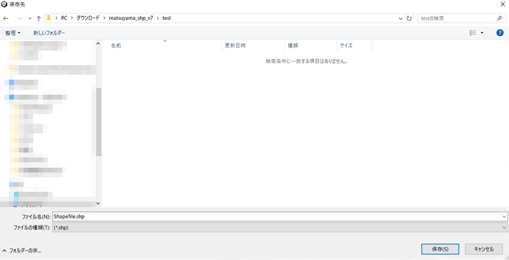
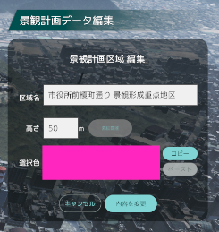
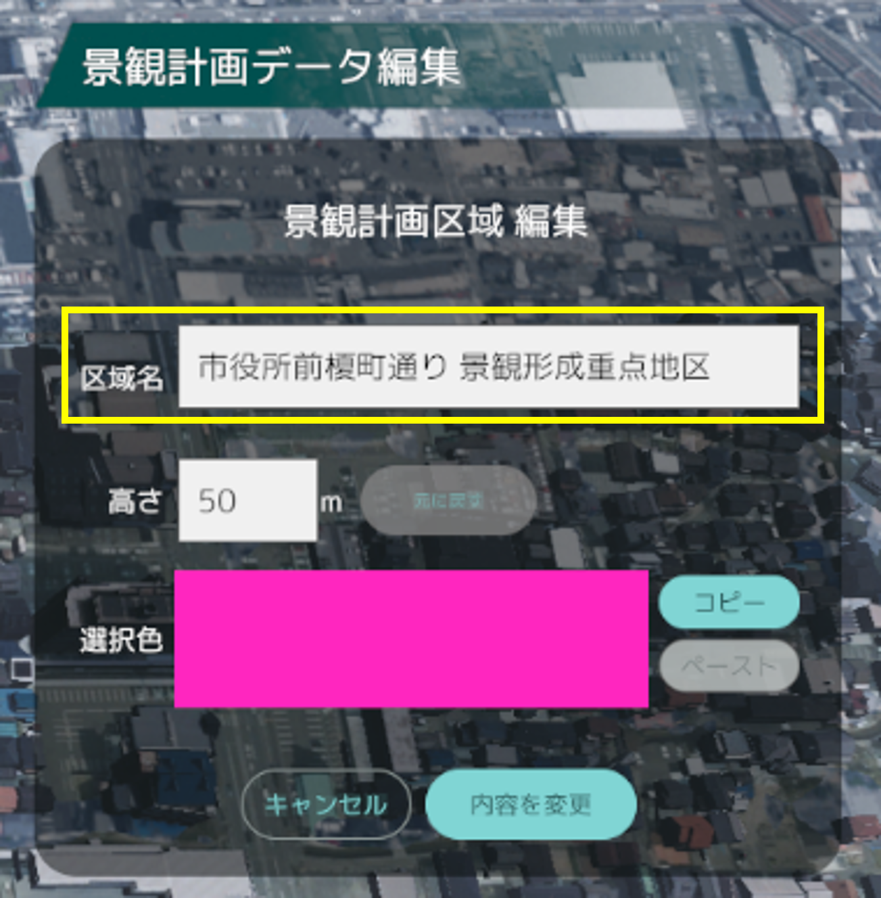
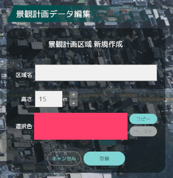
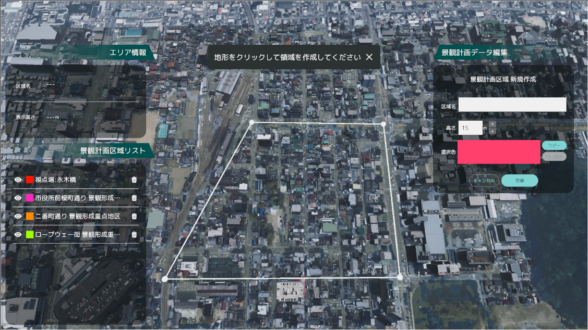

# 景観計画区域画面の操作方法

景観計画区域画面では、Shapefile 形式の景観計画区域の読み込み・可視化・編集を行います。

## 景観計画区域のデータ形式

### Shape ファイルデータ形式

この機能では、以下のデータ形式の Shape ファイルに対応しています。

- ストレージ：ESRI Shapefile
- 文字コード：Shift_JIS
- ジオメトリ：Polygon (MultiPolygon)
- 座標参照系(CSR)：EPSG:4326-WGS84（緯度経度形式）

### 属性テーブル形式

属性テーブルには以下の項目を設定できます。
 　※項目が存在しない場合は、初期値が適用されます。
 　※以下の項目以外の属性が含まれる場合でも動作に支障はありません。

| 項目名   | 型               | 入力情報　　　　 | 入力データ形式                                     | 初期値       |
| -------- | ---------------- | ---------------- | -------------------------------------------------- | ------------ |
| ID       | テキスト(string) | ID 番号          | 整数値                                             | 0            |
| AREANAME | テキスト(string) | 区域名           | 半角・全角文字                                     | 空欄         |
| HEIGHT   | テキスト(string) | 区域の高さ制限値 | 正の実数値                                         | 0            |
| COLOR    | テキスト(string) | 区域の表示色     | RGB 形式 「,」区切り 0 から 1 の範囲の小数値 | 白色 (1,1,1) |

入力例

## 画面構成

- 「エリア情報」パネルでは、選択中の景観計画区域の区域名と高さ制限値が表示されます。
- 「景観計画区域リスト」パネルでは、読み込み済みの景観計画区域の一覧が表示されます。
  - 「景観計画区域リスト」パネルの目アイコンをクリックすると、該当区域の表示/非表示を切り替えることができます。
  - 「景観計画区域リスト」パネルのゴミ箱アイコンをクリックすると、該当区域を削除できます。
- 「景観計画データ編集」パネルでは、景観計画区域の編集を行うことができます。
- 景観計画区域の壁には、上辺と高さ 10m ごとにラインが描画されます。

## 景観計画データの読み込み

「景観計画データ編集」パネルのデータ読み込みボタンをクリックすると、エクスプローラーが表示されます。

読み込む景観計画の Shape ファイルと dbf ファイルが含まれるフォルダーを選択し、「フォルダーの選択」をクリックします。

「景観計画区域リスト」パネルにエリア情報が追加されると読み込み完了です。
 　※読み込みには数秒を要する場合があります。

## 景観計画データの書き出し

「景観計画データ編集」パネルのデータ書き出しボタンをクリックすると、エクスプローラーが表示されます。

景観計画の Shape ファイルと dbf ファイルの保存先を選択し、「保存」をクリックします。

エクスプローラーに Shape ファイルと dbf ファイルが保存されると書き出し完了です。
 　※ cpg ファイルおよび shx ファイルが同時に出力されることがあります。

## 区域情報の編集

「景観計画区域リスト」パネルから編集したい区域名を選択します。

次に「景観計画データ編集」パネルの「データを編集」ボタンをクリックし、編集を開始します。

編集では、区域名、高さ制限値、区域カラーを変更できます。

編集完了後は「内容を変更」ボタンをクリックし、変更内容を保存します。
 　※「キャンセル」または他の区域が選択された場合、変更内容は破棄されます。

### 区域名編集

- 区域名は半角・全角文字に対応しています。
   　※全角文字入力後は Enter キーを押して変換を確定させてください。

### 高さ制限値の編集

- 高さ制限値の入力は半角数字のみ対応します。
- 区域の新規作成時、区域内の施設の高さが変更されます。入力された高さに達していない施設には影響がありません。
- 区域の編集時、高さ制限値を変更すると、即座に施設の高さが変更されます。

### 区域カラー編集

- 選択色のパネルをクリックすると「色彩変更」パネルが表示されます。

- カラー選択は、マンセル表または RGB 値での入力に対応します。
- パネル右上の ☓ ボタン、または再度選択色のパネルをクリックするとパネルが閉じます。

- 選択色のパネルの右にある「コピー」ボタンを押すと現在の色を保持することができ、他の区域の「色彩変更」パネルで「ペースト」を押すことで、保持した色を他の区域に反映させることができます。

### 区域頂点編集

- 区域の頂点に表示されているピンをクリックしながらマウスを動かすことで、頂点を移動させることができます。
   　※ラインが交差してしまった場合、頂点が変更前の位置に戻ります。
- ピンとピンの間のラインをクリックすることで中点に頂点を追加することができます。
- ピンをダブルクリックすることで頂点を削除できます。 
   　※頂点を 3 つ以下にすることは出来ません。

## 区域情報の作成

「景観計画データ編集」パネルの「新規作成」ボタンをクリックし、作成を開始します。

区域情報の作成では、区域情報の編集と同様に区域名、高さ制限値、区域カラーを変更できます。

### 区域作成

- 3D ビューにおける地面をクリックすると、区域の頂点が生成されます。
- 作成したい区域を 4 つ以上の頂点で囲みます。
- 最初に生成した頂点をクリックするとエリアが閉じられ「登録」ボタンが表示されます。
   　※交差している頂点がある場合、「登録」ボタンをクリックしても区域は作成されません。
- 頂点を配置し直す場合は「景観計画区域 新規作成」パネル内の「キャンセル」ボタンを押すと「新規作成」ボタンが表示される状態まで戻ります。

完了後は「登録」ボタンをクリックし、変更内容を保存します。
 　※エリアが閉じると「登録」ボタンが表示されます。
 　※交差している頂点がある場合、「登録」ボタンをクリックしても区域は作成されません。
 　※生成した区域の編集は「区域情報の編集」の項目を参照してください。
