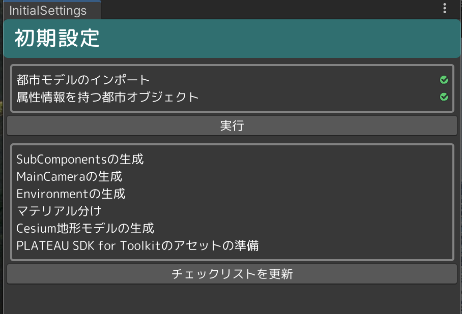

# セットアップの手順

本書では、ツールのセットアップ手順について記載しています。

## 初期設定機能の実行

- PLATEAU→InitialSettingsの順に選択し、初期設定画面を開きます。

- 実行に必要なコンポーネントがシーン上に全て揃っている場合、「実行」ボタンが押せる状態になります。

- 初期設定画面の「実行」ボタンを押して、初期設定の処理を開始します。

- 実行に必要なコンポーネントがシーン上に全て揃っていない場合、実行可能な状態にした後、「チェックリストを更新」ボタンを押すことで、「実行」ボタンが押せる状態になります。