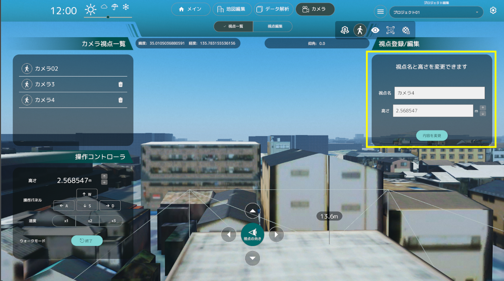

### 視点編集機能

- 視点編集機能では、カメラの状態が俯瞰視点か歩行者視点かで機能が変わります。

## 俯瞰視点時

- 俯瞰視点時、画面右の「視点登録/編集」パネルの視点名を入力し、登録ボタンをクリックすることで現在の視点を登録することができます。
  
- 「視点一覧」パネルから俯瞰視点を選択した後、画面右の「視点登録/編集」パネルで選択した視点の名前を編集できます。
- 視点名を編集して「内容を登録」ボタンをクリックすることで、視点の名前を変更することができます。
  

## 歩行者視点時

- 歩行者視点の間は、画面右の「視点登録/編集」パネルで視点名を入力し、登録ボタンをクリックすることで現在の視点を歩行者視点として登録することができます。
- また、「視点登録/編集」パネルでは歩行者視点カメラの高さを変更することができます。
  
- 「視点一覧」パネルで歩行者視点を選択した後、画面右の「視点登録/編集」パネルで選択した視点の名前が編集できます。
- 視点名を編集する、または歩行者視点カメラの高さを編集して「内容を登録」ボタンをクリックすることで、視点の名前を変更することができます。
  
