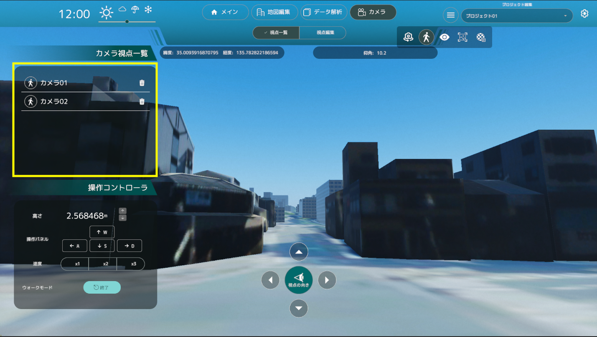

# 視点一覧の機能

- 視点一覧機能では、カメラの状態が俯瞰視点か歩行者視点かで機能が変わります。

## 俯瞰視点時

- 俯瞰視点時、登録されたカメラ視点が一覧となって画面左の「カメラ視点一覧」パネルに表示されます。
- 登録されたカメラ位置はリストとなって表示され、クリックすることで登録されたカメラ視点を復元します。

## 歩行者視点時

- 歩行者視点時、登録されたカメラ視点の内、歩行者視点のみが一覧となって画面左の「カメラ視点一覧」パネルに表示されます。

- 登録されたカメラ位置はリストとなって表示され、クリックすることで登録されたカメラ視点を復元します。

