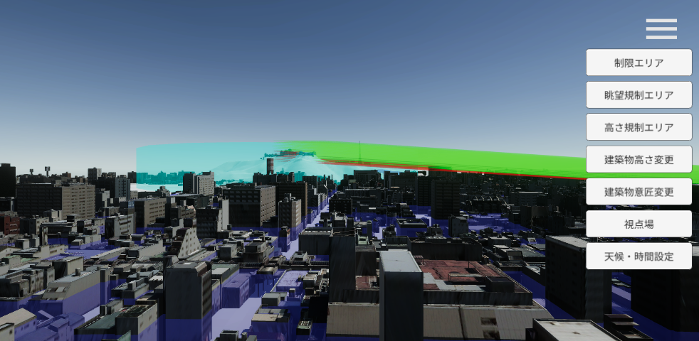
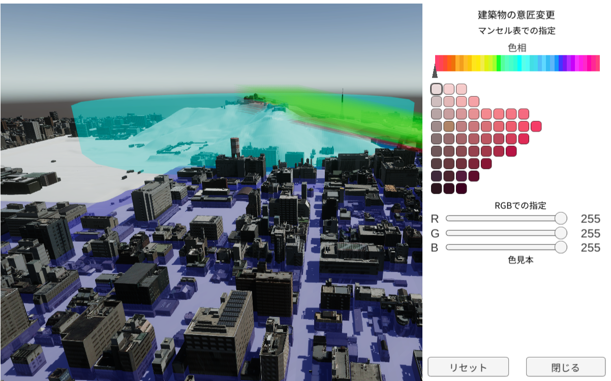
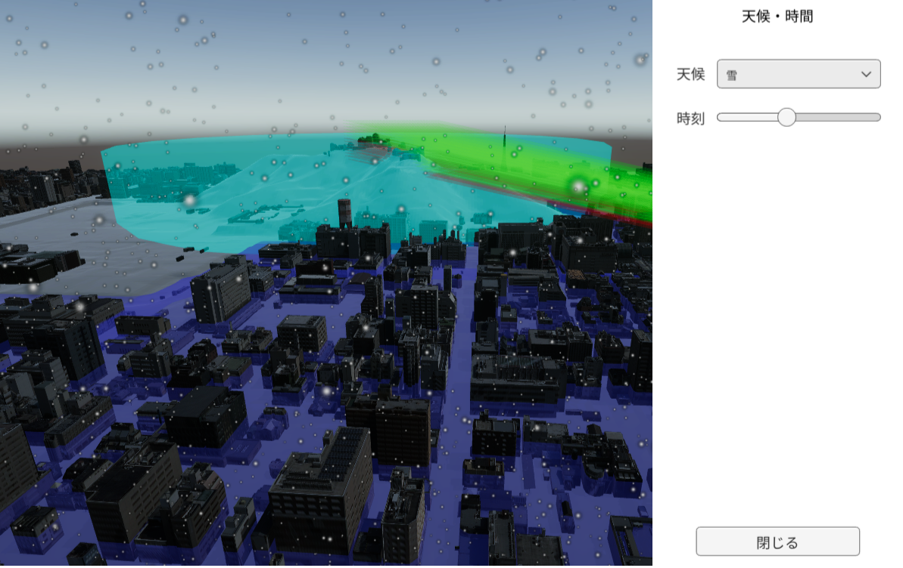

## ビルドアプリでの機能
本ツールを用いて編集されたシーンをアプリケーションとして配布する際に活用できる機能として、以下の機能を提供しています。

- ウォークスルー(視点移動)機能
- 景観計画の表示切替機能
- 建築物の高さ変更機能
- 建築物の意匠変更機能
- 視点場からの見え方の確認機能
- 天候・時間設定

Unity画面内の再生ボタン(画像上の▷ボタン)を押してシーンを再生することでビルドアプリの動作を確認できます。再生後、右上のメニューボタンを押すことで各機能にアクセスできます。

### ウォークスルー(視点移動)機能
アプリ内での視点操作は以下のように行えます。

- WASDキー
   - 視点の前後左右移動
- マウスホイール
   - 視点の前後移動
- 右クリックしながらマウス移動
   - 視点の回転

### 景観計画の表示切替機能
メニューから「規制エリア」「眺望規制」「高さ規制エリア」を選択後、表示ボタン・非表示ボタンを押すことで各エリアの表示・非表示の切り替えが行えます。

### 建築物の高さ変更機能
メニューから「建築物高さ変更」を選択します。

規制エリア(青色のエリア)をクリックしたうえで「高さ変更」ボタンを押すことで制限された高さに建築物の高さを変更することができます。

### 建築物の意匠変更機能
メニューから「建築物意匠変更」を選択します。

画面内で選択された建築物の意匠変更を行うことができます。設定方法はマンセル表からの指定とRGBでの指定が可能です。

マンセル表から選択したい場合、まず「色相」スライダで色相を選択します。選択された色相で表現可能な色の一覧が表示されるので、その中から色を選択してください。

### 視点場からの見え方確認機能
メニューから「視点場設定」を選択します。

ツールで設定した視点場の一覧から選択することで視点場からの見え方を確認することができます。

### 天候・時間帯変更機能
メニューから「天候・時間設定」を選択します。

時間帯の設定に加えて、「晴れ」「薄曇り」「曇り」「雨」「雪」から天候を設定することができます。

