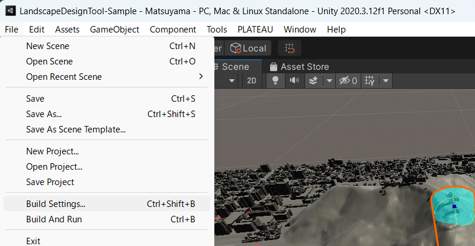
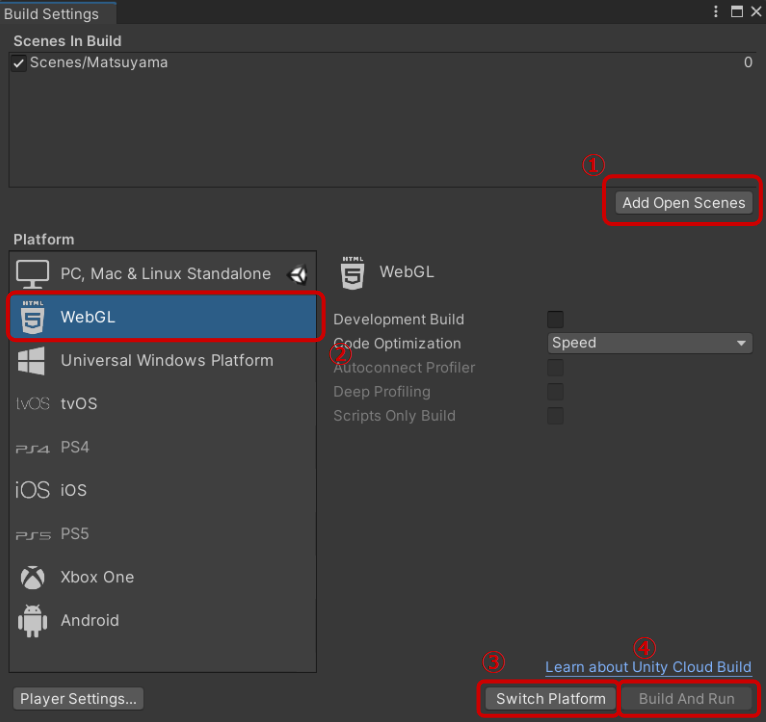

### Web向けのビルド

メニューからFile → Build Settingsを選択して、Build Settings画面を開きます。

Build Settings画面で以下の操作を行います。

1. Add Open Scenesボタンを押します。これによって現在開いているシーンがビルド対象に設定されます。
2. 左のパネルからWebGLを選択します。WebGLが入っていない場合は、Importボタンを押してください。
3. Switch Platformを押します。切替に数分間かかります。
4. Build And Runを押すとビルドが実行され、ローカル環境で動作を確認することができます。WebGLをImportした直後ではBuild And Runを押せないことがあるため、その際はUnityを再起動して手順1からやり直してください。

