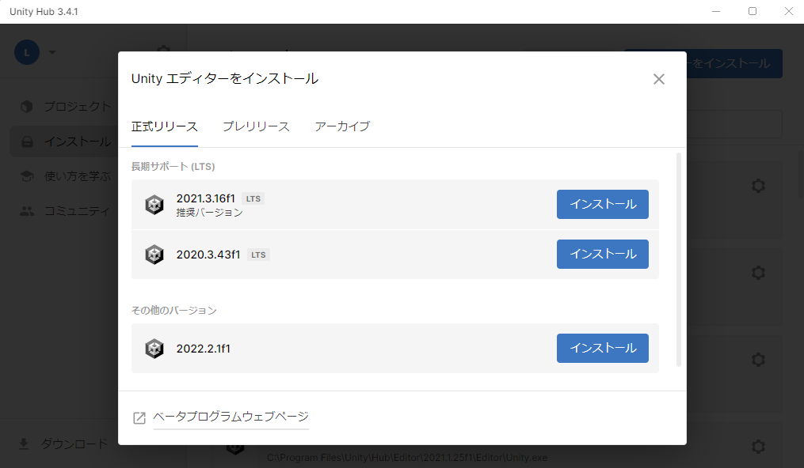
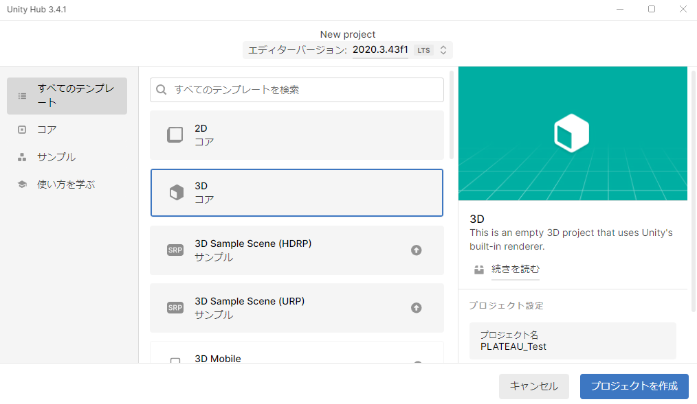
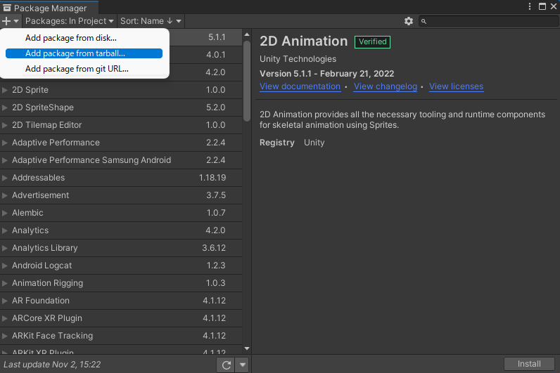
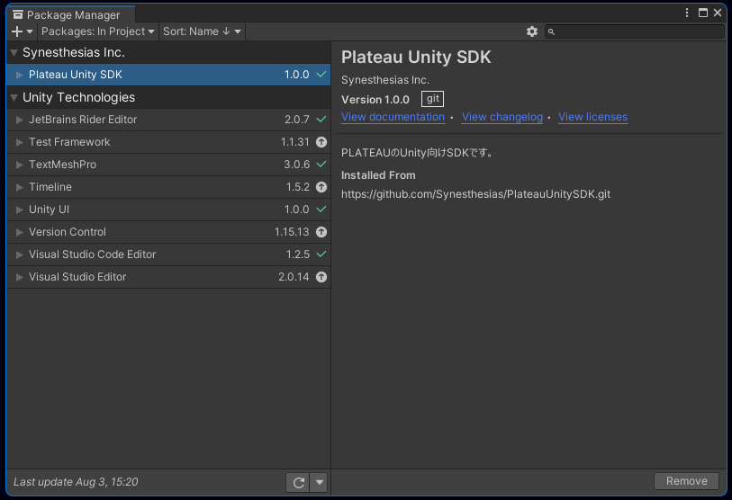
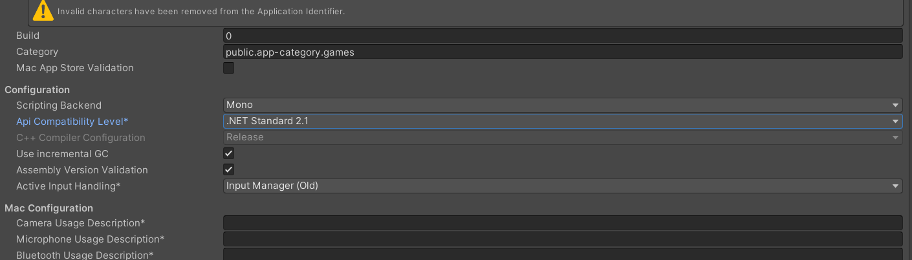
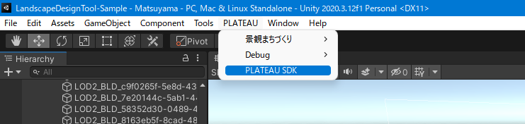

# インストール方法
## Unityインストール
- Unity Hub を[こちら](https://unity3d.com/jp/get-unity/download)からインストールします。
- Unity Hub とは、Unityのお好きなバージョンをインストールして起動することのできるソフトウェアです。
- Unity Hubを起動し、左のサイドバーからインストール → 右上のボタンからエディターをインストール をクリックします。

Unity 2021.3 で始まるバージョンを選択し、インストールを押します。

## Unityプロジェクトを作成
Unity Hub を起動します。左サイドバーの `プロジェクト` を押し、右上の `新しいプロジェクト` ボタンをクリックします。

新しいプロジェクトの設定画面で、次のように設定します。 
- 画面上部の `エディターバージョン` を `2021.3` で始まる番号にします。 
- 画面中部の `テンプレート` は `3D` を選択します。  
- 画面右下のプロジェクト名をお好みのものに設定します。 
- `プロジェクトを作成` ボタンを押します。

## ツールをUnityにインポート
- [LandscapeDesignToolのtgzファイルをダウンロードします。](https://github.com/Synesthesias/PLATEAU-UC22-045-landscape-design-tool/releases/download/v1.1.0/LandscapeDesignTool-v1.1.0.tgz)
- [PLATEAU SDK for Unityのリリースページ](https://github.com/Project-PLATEAU/PLATEAU-SDK-for-Unity/releases/tag/v1.1.0)
から、PLATEAU SDKのtgzファイルをダウンロードします。
- Unityのメニューバーから `Window` → `Package Manager` を選択します。
- Package Manager ウィンドウの左上の `＋` ボタンから `Add pacakge from tarball...` を選択します。 

- 先ほどダウンロードした PLATEAU SDK の tgz ファイルを指定します。するとウィンドウのパッケージ一覧に `PLATEAU SDK for Unity` が表示されます。

- 次に 同じく `＋` ボタンから `Add pacakge from tarball...` を選択し、景観まちづくりツールの tgz ファイルを指定します。するとパッケージ一覧に 景観まちづくり支援ツール が表示されます。
- Package Manager ウィンドウを閉じます。

## プロジェクトの設定
Unityのプロジェクト設定をします。メニューバーから Edit → Project Settings… を選びます。

Project Settings ウィンドウの左側のパネルから「Player」を選択し、「Api Compatibility Level」が「.NET Standard 2.1」ではない場合「.NET Standard 2.1」に変更して設定ウィンドウを閉じます。

## 事前準備
### PLATEAUの都市モデル(CityGML)データの用意
事前にG空間情報センターの[3D都市モデル（Project PLATEAU）ポータルサイト](https://www.geospatial.jp/ckan/dataset/plateau)から景観計画・協議を行いたいエリアの都市モデルデータ(CityGMLファイル一式)をダウンロード、解凍してください。

> [!NOTE]  
> 都市モデルデータには地形(demフォルダ), 建築物(bldgフォルダ)が含まれている必要があります。

## 都市モデルのインポート
### 都市モデルインポート画面を開く
メニューから `PLATEAU->PLATEAU SDK` を選択します。

表示されるウィンドウで都市インポートの設定を行います。インポート元を選択し、基準座標系を選んで「範囲選択」ボタンを押してください。インポート元は、ローカルの場合は 「udx」という名前のフォルダの1つ上のフォルダになります。

詳しくは [PLATEAUマニュアル: インポート](https://project-plateau.github.io/PLATEAU-SDK-for-Unity/manual/ImportCityModels.html) をご覧ください。

### 範囲選択
範囲選択画面では、マウスホイールの上下でズームイン・ズームアウト、右クリックのドラッグで視点移動します。オレンジ色の球体をドラッグして範囲を選択し、シーンビュー左上の「決定」ボタンを押します。

インポートに含める地物の種類を選択します。
景観まちづくり機能を利用するには、次をすべて満たす設定にしておく必要があります。

- 「建築物」と「土地起伏」で、「インポートする」にチェックが入っていること
- 「建築物」と「土地起伏」で、「MeshColliderをセットする」にチェックが入っていること
- 「建築物」で、「モデル結合」はそのまま（主要地物単位）にしておくこと

設定したら「モデルをインポート」ボタンを押します。そのままウィンドウを下にスクロールすると処理の進行状況が表示されるので、すべて「完了」になったらインポートは完了です。