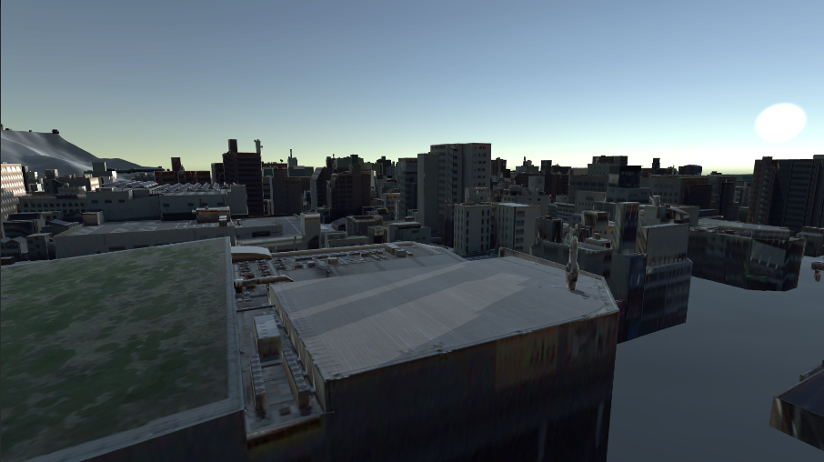
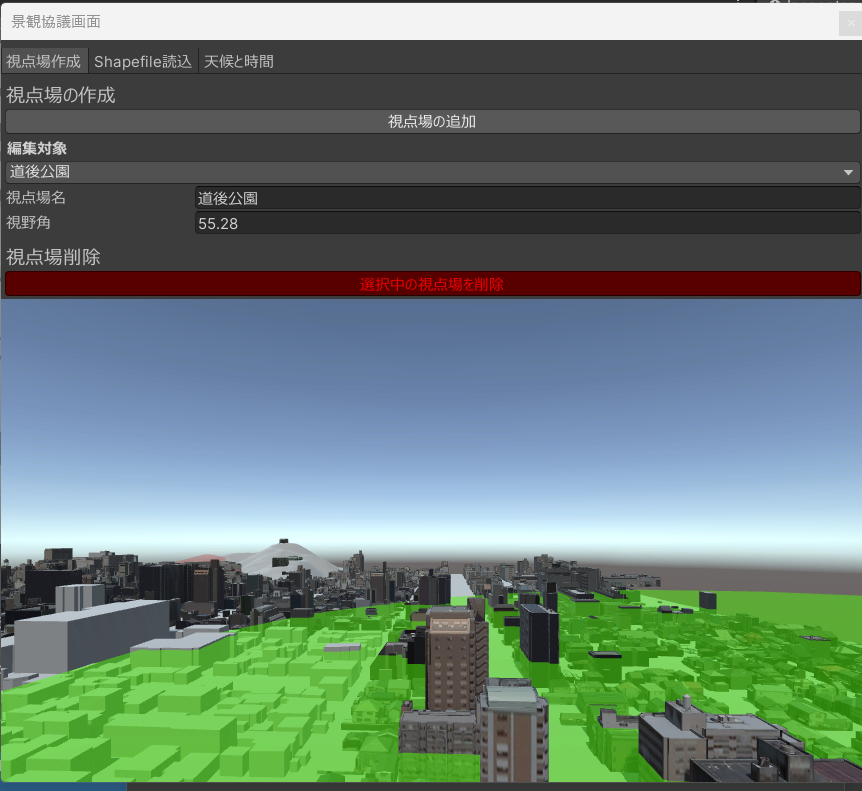
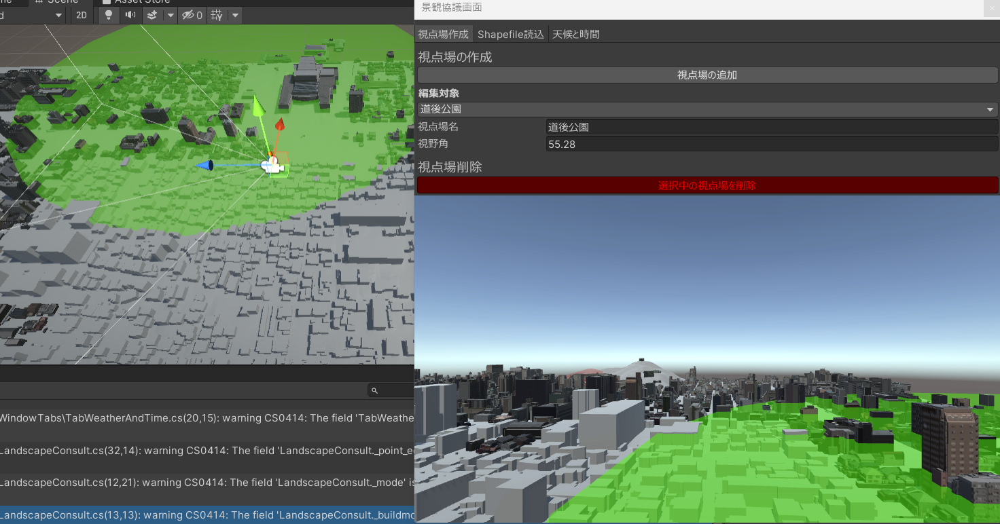

# 景観協議
## 天候・時間帯の変更
景観協議画面から天候・時間帯タブを選択します。

時間と天候を変更することで日照条件を変更します。

昼間の場合：

夕暮れの場合：

## 視点場からの建築物の見え方の確認
景観協議画面からカメラ操作タブを選択します。

視点場を追加するには、「視点場を追加」ボタンをクリックします。

シーン画面にカメラアイコンが表示されるので適宜移動します。景観協議画面には視点場からの風景のプレビューが表示されます。

### アプリでの確認
設定した視点場はビルドアプリ内で利用が可能です。詳細は「ビルドアプリでの機能」の項目を参照してください。