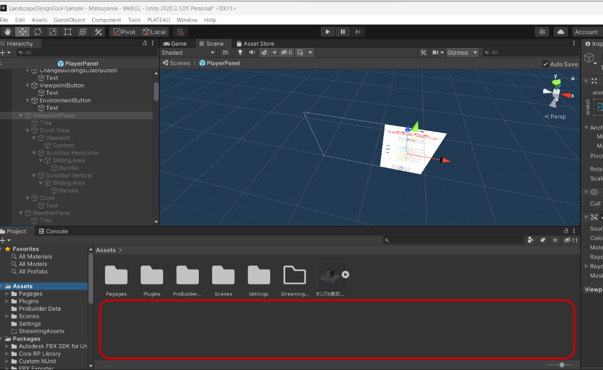
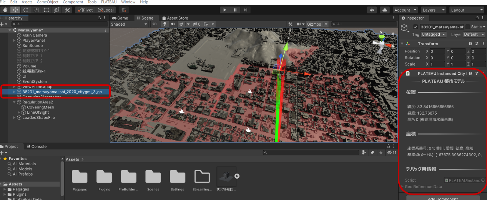
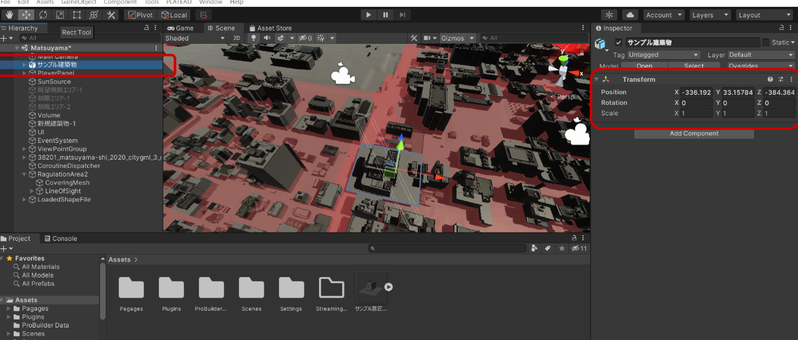
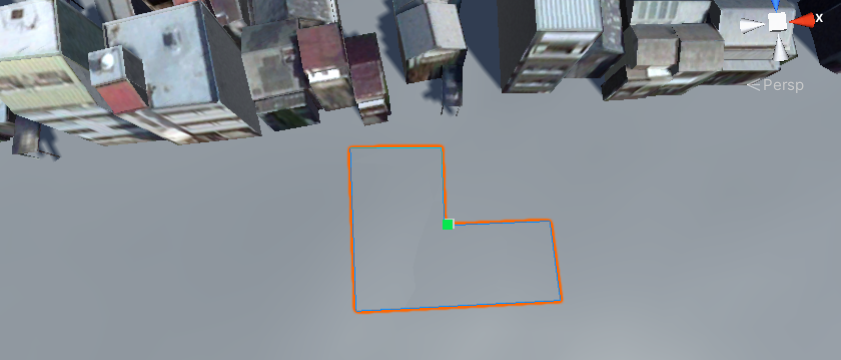
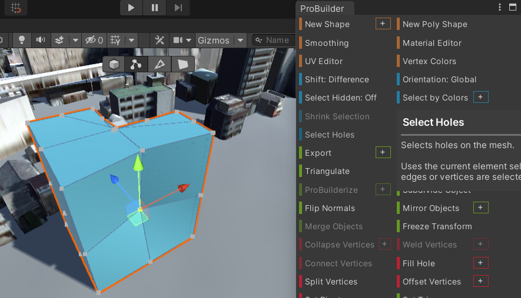

### 新規建築物のBIM・CADデータの読み込み・配置
Unityに建築データを読み込むには以下の手順が必要です。もし建築データの平面直角座標系での座標が分からない場合は手動での位置合わせが必要です。

1. 建築データの平面直角座標系での座標を確認します。
    1. 例えばRevitであればプロジェクト基準点の平面直角座標系での座標を確認してください。

2. 使用しているBIM・CADソフトからFBX形式で出力します。
3. Unityにインポートします。画面下のProject画面の空白部分にFBXファイルをドラッグすることでインポートが出来ます。

4. インポートしたFBXファイルをシーンにドラッグすることで配置します。

5. 都市モデルの原点情報を確認します。ヒエラルキー画面(画像左側)からインポートした都市モデルを選択すると、インスペクタ画面(画像右側)に原点の情報が表示されます。この中の基準点(メートル)の値をメモしておきます。

6. 先程配置したFBXファイルをヒエラルキー画面(画像左側)で選択して、インスペクタ画面(画像右側)のPositionの値を{建築データの平面直角座標系での座標} - {都市モデルの基準点}に設定します。この際、建築データの座標がメートル単位であることを確認してください。プロジェクト基準点の真北の方向が0°でない場合、RotationのYの値を同じ値に設定してください。

### 新規建築物の作成
メニューから `Tools -> ProBuilder -> ProBuilder Window` を選択します。

ProBuilder画面が開くので、 New Poly Shapeを選択します。

シーン内で底面形状を指定します。

上方向にドラッグし、建築物の高さを設定します。

### 新規建築物の編集
ProBuilderの画面から各機能にアクセスできます。

### 既存建築物の削除
シーンから既存建築物を選択し、deleteボタンを押すことで削除が可能です。