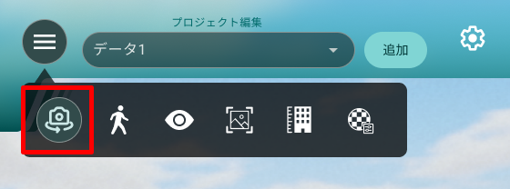
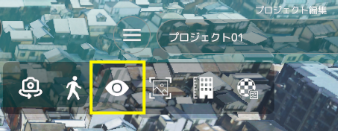
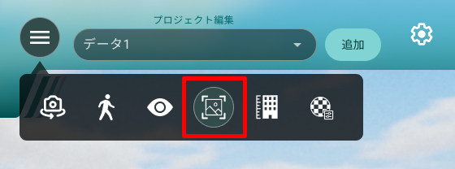
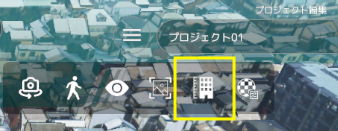
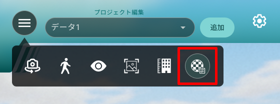

# グローバルナビ各種機能

画面上部グローバルナビゲーションの各種機能を記載しています。

## 気象変更機能

- 3D ビューの気象変更が可能です（晴れ・曇り・雨・雪）

## 時間帯変更機能

- スライダーで変更すると時間帯の変更を行うことが出来ます。

## ヘルプ機能表示ボタン

- 下記画像にあるボタンをクリックするとヘルプ機能が表示されます。

#### ＜ヘルプ＞カメラ自動回転機能

- 現在の視点を中心にカメラが自動回転するようになります。

#### ＜ヘルプ＞歩行者視点モード機能

カメラが歩行者視点（約 1.7m 標準）に切り替わります。

#### ＜ヘルプ＞ UI 表示・非表示機能

画面左右にあるユーザーインターフェースの表示/非表示が出来ます。

#### ＜ヘルプ＞スクリーンショット機能

現在の視点をスクリーンショットすることが出来ます。

#### ＜ヘルプ＞建物高さ表示機能

現在の視点から見える建物の高さを表示することが出来ます。

#### ＜ヘルプ＞ UI 表示・非表示機能

建物のテクスチャ切り替え表示することが出来ます。
