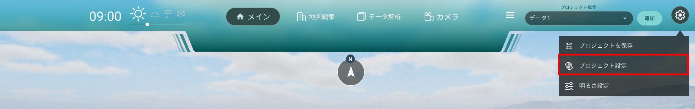

# プロジェクト保存・読込・編集機能

- プロジェクトの新規作成・保存・読込機能を記載しています。

### プロジェクト新規作成

- 追加ボタンを押下すると新しいプロジェクトを作成することが出来ます。

### プロジェクト全体を保存する

- 設定ボタンを押下し、リストから「プロジェクトを保存」を選択しすると PC 上に保存が可能です。

### 別プロジェクトを読み込む

- 設定ボタンを押下し、リストから「プロジェクト読込」を選択しプロジェクトを選択すると、現在のプロジェクトに追加されます。

### 個別のプロジェクトをリストから選択する

- プロジェクトリストをクリックすると現在のシーンに作成されているプロジェクト一覧リストが表示されます。
  リストを選択すると、選択したプロジェクトに格納されているデータが表示されます。
- 名前編集：名前の編集が行えます。
- 削除：選択したプロジェクトの削除が行えます。
- 書き出し：選択したプロジェクトの個別書き出しが行えます。

### 選択プロジェクトを編集

- 選択したプロジェクトを編集する場合はプロジェクトリスト上部にある「編集トグルボタン」を ON にすると編集することができます。
